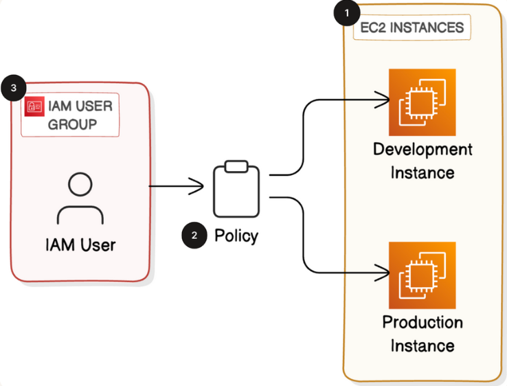

# Cloud Security with AWS IAM

## Overview

In this project we'll be using the AWS **Identity and Access Management (IAM)** service to control who is authenticated (signed in) and authorized (has permissions) in our AWS account.

We'll also launch two **EC2** instances and control who has access to them by creating some **IAM policies** and **user groups**.

**Amazon EC2** is a service that lets you rent and use virtual computers in the cloud. You can create, customize and use these computers for all different reasons, from running applications to hosting websites.

## Architecture

## Implementation Steps

### 1. Initial AWS Setup and Region Selection

Once I created my AWS account I gained access to the Management Console. I headed over to the EC2 service and first and foremost I changed the region to be the closest to me.

### 2. Launch Production EC2 Instance

In the EC2 console I launched a new instance with a name I gave along with a tag and more specifically 'Key:Env, Value:production'. I proceeded by choosing the virtual computer's settings like AMI (Amazon Machine Image) and instance type. I selected the Amazon Linux 2023 AMI and chose the t2.micro instance type since it's free-tier eligible.

### 3. Launch Development EC2 Instance

After launching the production instance, I created a second EC2 instance following the same process but this time tagged it with 'Key:Env, Value:development'. These tags would become critical later for implementing tag-based access control in my IAM policies. With both instances running, I had my infrastructure foundation in place.

### 4. Create Custom IAM Policy with Tag-Based Conditions

Next, I navigated to the IAM service to create a custom permission policy. I wanted to ensure, for example, that our new intern would only have access to the development instance and couldn't accidentally (or intentionally) modify or terminate the production instance. I created a new policy using JSON format with conditions that check for the "Env:development" tag. This policy grants EC2 permissions like starting, stopping, and describing instances, but only when the "Env" tag equals "development". This is the principle of least privilege in action - the intern gets exactly what they need, nothing more.

### 5. Configure Account Alias

Before creating the intern's user account, I set up an account alias to make the login URL more user-friendly. Instead of a long URL with random account numbers, the alias creates something memorable like "mycompany-aws" which makes onboarding smoother and more professional.

### 6. Create IAM Group and Attach Policy

I then created an IAM group called "Interns" and attached my custom development-only policy to it (the one above). Using groups instead of attaching policies directly to users is a best practice because it makes permission management scalable. When you have multiple interns, they all inherit the same permissions from the group automatically.

### 7. Create IAM User and Assign to Group

With the group configured, I created a new IAM user for the intern with console access enabled. I added this user to the Interns group, which automatically applied the development-only permissions. I generated a temporary password and made sure to require a password change on first login for security.

### 8. Test Permissions and Validate Access Controls

To verify everything worked correctly, I logged out of my root account and logged in using the intern's credentials. I navigated to EC2 and confirmed that I could see both instances but could only perform actions on the development instance. When I tried to stop the production instance, I received an "access denied" error - exactly as intended. This testing phase is crucial because it validates that your security policies work before giving access to real users.

### 9. Cleanup Resources

Finally, once I confirmed the project was successful, I cleaned up all resources to avoid unnecessary costs. I terminated both EC2 instances, deleted the IAM user, removed the IAM group, and deleted the custom policy. I also verified in the billing dashboard that no resources were still running.

## Security Considerations

This project demonstrates several important security principles:

**Principle of Least Privilege**: The intern receives only the minimum permissions necessary to do their job. They can manage the development environment but have zero access to production resources. This limits the blast radius of potential mistakes or security incidents.

**Tag-Based Access Control**: By using resource tags in IAM policies, I created a flexible and scalable permission model. As we add more development or production instances in the future, the policy automatically applies the correct permissions based on tags without needing to update the policy for each new resource.

**Separation of Credentials**: Instead of sharing the root account credentials (which would be a critical security vulnerability), each person gets their own IAM user with unique credentials. This provides accountability through CloudTrail logs and allows us to revoke access individually without affecting other users.

**Group-Based Permission Management**: Attaching policies to groups rather than individual users makes permission management maintainable as the team grows. Adding a new intern is as simple as creating a user and adding them to the Interns group.

**Environment Separation**: The clear distinction between production and development environments prevents accidental changes to critical infrastructure while still allowing interns to gain hands-on experience.

## Cost Analysis

Understanding AWS costs is crucial for any cloud project:

**EC2 Costs**: While t2.micro instances are free-tier eligible for the first 750 hours per month, leaving instances running beyond the free tier or using larger instance types incurs hourly charges. Even small instances can add up to $8-10 per month if left running continuously.

**IAM is Free**: IAM users, groups, roles, and policies have no cost. You can create thousands of users and complex permission structures without any charges. This makes IAM an economical way to secure your AWS environment.

**Importance of Cleanup**: The most expensive cloud resources are the ones you forget about. Always terminate instances, delete snapshots, and remove unused resources when you're done with a project. I verified deletion by checking the EC2 console showed zero running instances and reviewing the billing dashboard.

## Key Takeaways

Through this project, I gained practical experience with several critical AWS concepts:

**IAM Fundamentals**: I now understand the difference between authentication (proving who you are) and authorization (what you're allowed to do). IAM handles both through users and policies.

**Policy Structure**: Working with JSON policies taught me how AWS evaluates permissions. The policy language uses Effect (Allow/Deny), Action (what operations), Resource (what AWS resources), and Condition (under what circumstances) to create precise permission controls.

**Tag-Based Access Control**: Tags aren't just for organization - they're powerful tools for implementing scalable security policies. The condition `"StringEquals": {"ec2:ResourceTag/Env": "development"}` is the most crucial in the custom policy.

**Hands-On Testing**: Theoretical knowledge isn't enough. Actually logging in as the intern and testing the permissions revealed whether my policy worked correctly. Always test your security controls.

**Resource Lifecycle Management**: Creating resources is easy; remembering to delete them is harder. Building a habit of immediate cleanup prevents cost overruns and maintains a clean AWS environment.

