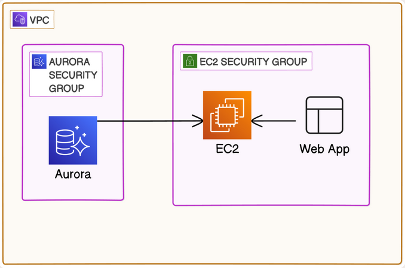

# EC2 Web App with RDS PostgreSQL Database

## Overview

Amazon RDS (Relational Database Service) is AWS's managed relational database offering. It handles the operational burden of running a database—provisioning, patching, backups, and replication—so the focus can stay on the application layer rather than database administration. Unlike running PostgreSQL directly on an EC2 instance, RDS automatically takes daily backups, supports automated minor version upgrades, and can be promoted to Multi-AZ with a single configuration change. The managed nature of RDS is exactly why it appears in virtually every production AWS architecture that requires a relational database.

I built this project to understand the standard three-tier web architecture: a publicly accessible compute layer (EC2) sitting in front of a privately isolated data layer (RDS), connected through security group rules rather than network routes. This pattern is the backbone of web applications in AWS, and understanding it from first principles, how traffic flows, why the database has no internet route, why the security group reference matters more than a CIDR range, is essential for building anything real.

This project also marks a significant shift in methodology. Rather than using the AWS Console, every resource is defined in Terraform and committed to version control. The infrastructure became reproducible: `terraform apply` provisions the entire stack from scratch, and `terraform destroy` tears it down cleanly. The original design targeted Aurora PostgreSQL, but after discovering that Aurora is not free tier eligible and that version availability varies by region, I switched to standard RDS PostgreSQL. That discovery process taught me more than if everything had worked the first time.

Technologies used: AWS VPC, EC2, RDS PostgreSQL, Security Groups, Network ACLs, Elastic IP, Terraform, Amazon Linux 2023, Apache (httpd), PHP, PDO PostgreSQL, PostgreSQL 15.

## Architecture

Traffic enters through the Internet Gateway and reaches the EC2 instance in the public subnet via its Elastic IP. The instance runs Apache and PHP, accepting HTTP/HTTPS from anywhere and SSH from my IP only. The RDS database sits in two private subnets across two Availability Zones, required by AWS for DB subnet groups, with no internet route and no public accessibility flag. The database security group accepts PostgreSQL connections on port 5432 exclusively from the EC2 security group, meaning no IP address can reach the database directly, only resources attached to the EC2 security group can.

## Implementation Steps

### 1. Starting with Aurora, Switching to RDS

I originally designed this project around Aurora PostgreSQL. Aurora offers distributed storage, automatic replication across three Availability Zones, and faster failover than standard RDS. However, two blockers emerged immediately. First, Aurora is not covered by the AWS free tier, it requires a paid account or a specific Serverless v2 Express configuration with `min_capacity=0`, which requires Terraform AWS provider 5.77 or later. Second, when I checked which Aurora PostgreSQL versions were available in `eu-west-3`, version 15.4 (which I had hardcoded) did not exist in that region. I learned to always query available versions with `aws rds describe-db-engine-versions --engine aurora-postgresql --region eu-west-3` before hardcoding anything. I switched to standard RDS PostgreSQL `db.t3.micro`, which is free tier eligible, uses the same PostgreSQL engine, and requires only a single `aws_db_instance` resource instead of Aurora's two-resource cluster-plus-instance model.

### 2. VPC and Subnet Architecture

I built the VPC with a `10.0.0.0/16` CIDR, one public subnet (`10.0.1.0/24`) for the EC2 instance, and two private subnets (`10.0.2.0/24` and `10.0.3.0/24`) across two Availability Zones for the RDS database. The two private subnets are not optional: AWS requires a DB subnet group to span at least two AZs, even for a single-AZ RDS instance. The public subnet has a route table with a default route to the Internet Gateway. The private subnets have no route table association with the IGW, so there is literally no network path from the internet to the database.

### 3. Security Groups and the Security Group Reference

The EC2 security group allows SSH on port 22 from my IP only (detected dynamically at plan time), HTTP and HTTPS from anywhere, and all outbound traffic. The database security group allows port 5432 inbound using `security_groups = [aws_security_group.test_instance_sg.id]` rather than a CIDR block. This is an important distinction. A CIDR-based rule allows any host in that IP range to connect. A security group reference allows only resources attached to that specific security group. If I added another EC2 instance to the same subnet but gave it a different security group, it could not reach the database. The access control is attached to the identity of the resource, not its location.

### 4. Network ACLs

I applied two NACLs: one for the public subnet covering SSH (my IP only), HTTP, HTTPS, and ephemeral ports (1024–65535) in both directions; one for the private subnets allowing only port 5432 inbound from the public subnet CIDR and ephemeral ports outbound back to the public subnet. NACLs are stateless, so return traffic must be explicitly permitted. The ephemeral port rules exist precisely because TCP connections use a dynamically assigned source port for the return path. Forgetting ephemeral ports is a common mistake when working with NACLs for the first time. The private NACL deliberately permits nothing else, no SSH, no HTTP, no general outbound, because the database has no reason to initiate or receive any other type of connection.

### 5. RDS Provisioning

I configured the `aws_db_instance` resource with `storage_encrypted = true`, `publicly_accessible = false` (the default, but worth being explicit about), `skip_final_snapshot = true` for a learning environment, and `backup_retention_period = 1` for minimal backup history. The database credentials are passed from `terraform.tfvars`, which is gitignored. One operational lesson: RDS takes seven to ten minutes to provision. Terraform waits for the instance to become available before continuing, so `terraform apply` blocks during this time. Planning for that wait matters when iterating on the configuration.

### 6. user_data and the PHP Web Application

The EC2 instance runs a `user_data` bootstrap script that installs Apache and PHP, writes a database configuration file with the RDS endpoint and credentials, and deploys a PHP page that connects to PostgreSQL using PDO, creates a sample table, inserts a row, and displays the five most recent rows. The script runs once at first boot. If I change the script and run `terraform apply`, the instance will not re-run it. The change has no effect until the instance is replaced. I learned this the hard way and had to use `terraform apply -replace=aws_ec2_instance.test_instance` to force recreation. The `db_endpoint` output for RDS includes the `:5432` port suffix (e.g., `mydb.xxxx.eu-west-3.rds.amazonaws.com:5432`), unlike Aurora which returns the hostname alone. The PHP script uses the address attribute, which strips the port.

## Security Considerations

The most important security decision in this project is how database access is controlled. The database security group uses a security group reference, not a CIDR block, for the inbound PostgreSQL rule. This means only EC2 instances explicitly attached to the EC2 security group can reach the database on port 5432. If the EC2 instance were compromised and an attacker tried to pivot to the database from a different host, they could not, even from within the same VPC, unless they had the EC2 security group attached to their resource. This is identity-based network access control at the AWS infrastructure layer, before the database even sees the connection.

The database has no internet route. The private subnets have no association with the route table that points to the Internet Gateway. Even if `publicly_accessible` were accidentally set to `true` on the RDS instance, the routing table would not forward internet traffic to the private subnet. Defense in depth means the security controls do not depend on any single setting being correct.

Database credentials are stored in `terraform.tfvars`, which is included in `.gitignore`. Credentials should never appear in committed Terraform files or outputs. I also set `db_password` as a `sensitive = true` variable in `variables.tf`, which prevents Terraform from printing the value in plan or apply output. The credentials are injected into the EC2 instance via the `user_data` script using `templatefile()`, which means they are visible in the instance's EC2 console user data tab. In a production environment, the correct approach is AWS Secrets Manager: store the credentials there and have the application retrieve them at runtime using IAM role permissions, so credentials are never baked into the instance configuration at launch time.

Storage encryption is enabled on the RDS instance (`storage_encrypted = true`). This uses AES-256 encryption managed by AWS KMS to protect data at rest. It does not protect data in transit between the EC2 instance and the database—that requires configuring SSL/TLS in the PostgreSQL connection string, which is a natural next step for this project.

The Terraform state file contains the generated RSA private key in plaintext. Anyone with read access to `terraform.tfstate` can SSH into the instance. Local state is acceptable for a solo learning project, but any shared or production environment should use a remote backend, an encrypted S3 bucket with versioning and DynamoDB state locking, with IAM policies restricting who can read the state file.

## Cost Analysis

The EC2 `t3.micro` instance runs at approximately $0.0104 per hour on-demand, or roughly $7.50 per month if left running continuously. The AWS Free Tier covers 750 hours per month of `t3.micro` usage for the first 12 months, so this cost is $0 within the free tier window.

The RDS `db.t3.micro` instance is similarly free tier eligible: 750 hours per month and 20 GB of General Purpose (SSD) storage for the first 12 months. Outside the free tier, `db.t3.micro` costs approximately $0.018 per hour in `eu-west-3`, or roughly $13 per month. The 20 GB of RDS storage costs approximately $0.115 per GB-month, adding about $2.30 per month if not on free tier.

The Elastic IP is free while attached to a running EC2 instance. If the instance is stopped but the EIP remains allocated, AWS charges $0.005 per hour. Always release or destroy the EIP when stopping the instance for extended periods to avoid this charge accumulating silently.

RDS automated backups with `backup_retention_period = 1` retain one day of backups. Backup storage equal to the database size is included for free. Additional backup storage beyond the DB size is charged at approximately $0.095 per GB-month.

The most important cost practice for this project is running `terraform destroy` when done. Unlike console-built infrastructure where teardown requires remembering every resource and deleting them in the right order, `terraform destroy` removes everything in the correct dependency sequence automatically. RDS, security groups, subnets, and the VPC are all cleaned up in a single command. Forgetting to destroy RDS instances is a particularly common source of unexpected AWS bills because they continue accumulating charges even when idle.

## Key Takeaways

- **Aurora and RDS are not interchangeable from a Terraform perspective.** Aurora requires two resources (`aws_rds_cluster` and `aws_rds_cluster_instance`) plus a cluster-level parameter group, while RDS uses a single `aws_db_instance`. Knowing which resource model applies to the engine you are using avoids significant debugging time.

- **Always query available engine versions before hardcoding them.** Engine version availability varies by region and by engine type. `aws rds describe-db-engine-versions --engine <engine> --region <region>` returns exactly what AWS supports in that region. Hardcoding a version that does not exist produces cryptic API errors.

- **Security group references are more secure than CIDR-based rules for intra-VPC access.** A CIDR rule permits any host in a subnet. A security group reference permits only resources with that specific security group attached. For database access, the security group reference is always the correct choice.

- **Two private subnets across two AZs are required for DB subnet groups.** This is an AWS requirement regardless of whether Multi-AZ is enabled for the RDS instance. Plan the subnet CIDR allocation before provisioning to avoid conflicts.

- **user_data runs only at first boot.** Changes to the user_data script require instance recreation. Use `terraform apply -replace=aws_instance.<name>` to force this. Trying to re-run user_data by stopping and starting the instance does not work.

- **The RDS `endpoint` output includes the port suffix.** `aws_db_instance.postgres.endpoint` returns `hostname:5432`. If the application expects just the hostname, use `aws_db_instance.postgres.address` instead. Aurora returns the hostname without a port suffix, which is another behavioral difference between the two.

- **RDS provisioning takes seven to ten minutes.** This is normal. Terraform waits for the instance to enter the `available` state before proceeding. Factor this into the iteration cycle when making database configuration changes.

- **Credentials in user_data are visible in the EC2 console.** Injecting database credentials via `templatefile()` in user_data is acceptable for learning, but in production, credentials belong in AWS Secrets Manager. The application should retrieve them at runtime using an IAM role, not receive them baked in at launch.

- **`storage_encrypted = true` protects data at rest, not in transit.** Encrypting the RDS volume is a minimum baseline. Protecting the connection between EC2 and RDS requires configuring SSL/TLS in the application's connection string.

- **`terraform destroy` is one of Terraform's most practical advantages.** It removes all resources in the correct dependency order automatically, eliminating the manual teardown process that console-built infrastructure requires. Running it consistently after each learning session prevents forgotten resources from accumulating charges.

- **Defense in depth means every layer should enforce the intent independently.** The private subnets have no IGW route, the database security group restricts to the EC2 security group, the NACL allows only port 5432 from the public subnet, and `publicly_accessible` is false. Any one of these controls would be sufficient to block direct internet access, but relying on all four means no single misconfiguration opens the database.
