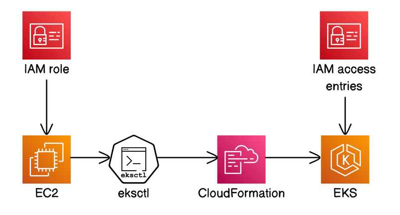
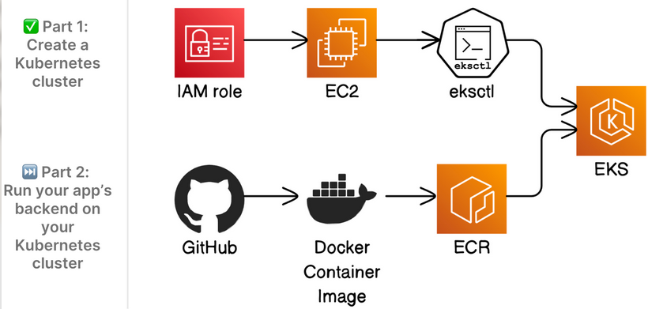

# EKS Kubernetes Cluster with Terraform

## Overview

A production-style Amazon EKS cluster on AWS, fully provisioned with Terraform. The architecture places worker nodes in private subnets with no public IP addresses, routes all outbound traffic through a NAT Gateway, and uses a bastion EC2 instance as the sole management entry point into the cluster. The goal was to build a real Kubernetes environment where network isolation, IAM boundaries, and operational access are all treated seriously rather than left as defaults.

The cluster access model uses EKS Access Entries, the modern API-based approach that replaces the legacy `aws-auth` ConfigMap. The bastion is granted read-only `kubectl` access through IAM, and the EKS API endpoint is restricted to a single IP at the network level. Infrastructure for this kind of cluster is what underpins most production Kubernetes deployments on AWS, and working through each piece, node IAM roles, subnet tagging for the load balancer controller, dynamic IP injection, builds fluency with how EKS actually works.

**Technologies:** Terraform · Amazon EKS 1.31 · EC2 (Bastion + Managed Node Group) · VPC (public + private subnets across 2 AZs) · NAT Gateway · IAM (EKS Access Entries) · CloudWatch (Control Plane Logs) · Amazon ECR · Docker · Flask · AWS CLI · kubectl · eksctl

---

## Architecture





```
Your Machine (SSH)
      │
      ▼
EC2 Bastion (public subnet, kubectl + eksctl installed)
      │  IAM Access Entry
      ▼
EKS Cluster (control plane)
      │
      ├── Public Subnets  (AZ-1, AZ-2) — bastion + NAT gateways
      └── Private Subnets (AZ-1, AZ-2) — worker nodes (no public IPs)
                │
                └── NAT Gateway → internet (ECR, AWS APIs)
```

**VPC:** 10.0.0.0/16 split across two availability zones. Each AZ has one public subnet and one private subnet, giving four subnets in total. DNS hostnames and DNS resolution are enabled so that EKS internal service discovery works correctly.

**Bastion:** A t3.micro EC2 instance in the first public subnet. It is the only management entry point into the cluster (`kubectl` and `eksctl` are installed at boot via a versioned, checksum-verified user data script). SSH access is restricted to a single CIDR (your IP at plan time, injected dynamically). Egress is limited to HTTPS (443) only, which is sufficient for all AWS API calls but prevents lateral movement.

**EKS Control Plane:** Managed by AWS. The API endpoint has both private and public access enabled, but the public access CIDR list is restricted to your IP only. All five control plane log types (api, audit, authenticator, controllerManager, scheduler) are shipped to CloudWatch.

**Worker Nodes:** A managed node group of t3.medium instances, deployed exclusively into the two private subnets. Desired count is 2, scaling between 1 and 3. Nodes have no public IP addresses. All outbound traffic, to ECR for image pulls, to AWS APIs for node registration, exits through the NAT Gateway.

**NAT Gateway:** A single NAT Gateway sits in the first public subnet with an attached Elastic IP. The private route table points all outbound traffic (0.0.0.0/0) through it. A single NAT Gateway is sufficient for this architecture; a second for AZ redundancy would double the cost and is not necessary for a learning environment.

---

## Project Structure

```
eks-kubernetes/
├── README.md
├── .gitignore
├── nextwork-flask-backend/   # Flask app source + Dockerfile
│   ├── app.py                # Hacker News search API (flask-restx, port 8080)
│   ├── requirements.txt      # Pinned Python dependencies
│   └── Dockerfile            # python:3.9-alpine image
└── terraform/
    ├── providers.tf          # AWS provider ~> 5.0, Terraform >= 1.6
    ├── variables.tf          # All input variables (profile, region, CIDRs, instance types)
    ├── data.tf               # AMI lookup, AZ data, dynamic IP, IAM assume role documents
    ├── network.tf            # VPC, 4 subnets, IGW, NAT Gateway, route tables
    ├── compute.tf            # Bastion EC2, IAM role, security group, key pair
    ├── eks.tf                # EKS cluster, node group, IAM roles, access entry
    ├── ecr.tf                # ECR repository with image scanning + lifecycle policy
    ├── outputs.tf            # Cluster name, endpoint, bastion IP, kubeconfig command, ECR URL
    ├── templates/
    │   └── userdata.tpl      # Bastion bootstrap: kubectl + eksctl with SHA-256 verification
    └── scripts/
        └── my_ip_json.sh     # Returns current public IP as JSON for external data source
```

---

## Implementation Notes

### Bastion as the Sole Management Path

The bastion is the only way to reach the cluster. There is no direct `kubectl` access from a local machine, the EKS API endpoint is restricted to the bastion's IP at the public access CIDR level. This means that even if someone obtained valid AWS credentials, they could not reach the API server unless their IP matched.

The bastion's IAM role has a single permission: `eks:DescribeCluster` on the specific cluster ARN. That is the minimum required to generate a kubeconfig. Everything else is done through the EKS Access Entry, which maps the bastion's IAM role to `AmazonEKSViewPolicy` (read-only kubectl) at cluster scope.

### EKS Access Entries vs. aws-auth ConfigMap

The legacy way to grant IAM principals access to Kubernetes was to edit the `aws-auth` ConfigMap in the `kube-system` namespace after cluster creation. This was error-prone: a malformed ConfigMap could lock out all access to the cluster. EKS Access Entries replace this with a proper API: `aws_eks_access_entry` creates the mapping, and `aws_eks_access_policy_association` attaches a managed Kubernetes policy to it. Both are managed in Terraform with no post-apply manual steps.

### Subnet Tagging for the Load Balancer Controller

All four subnets carry specific tags that the EKS load balancer controller uses to discover subnets when provisioning load balancers:

- Public subnets: `kubernetes.io/role/elb = 1` — for internet-facing load balancers
- Private subnets: `kubernetes.io/role/internal-elb = 1` — for internal load balancers

Without these tags, the AWS Load Balancer Controller cannot determine which subnets to place load balancers in and will refuse to provision them. The tags are set at subnet creation time in `network.tf`.

### Dynamic IP Injection

`scripts/my_ip_json.sh` is called via a Terraform `external` data source at plan time. It queries the current public IP and returns it as JSON. This value is used in two places: the bastion security group's SSH ingress rule, and the EKS cluster's `public_access_cidrs` list. The result is that no IP address is ever hardcoded, `terraform plan` always picks up the current IP, and the infrastructure is automatically updated if the IP changes on the next apply.

### ECR Repository

`ecr.tf` provisions a private ECR repository (`eks-cluster-repo`) for the Flask application image. Image scanning on push is enabled so that CVE reports are generated automatically for every pushed image. The encryption type is `AES256` (AWS-managed keys). A lifecycle policy retains only the 10 most recent images, preventing unbounded storage growth. The node group already carries `AmazonEC2ContainerRegistryReadOnly`, so worker nodes can pull images from the repository without any additional credentials.

### Managed Node Group

Worker nodes use a managed node group rather than self-managed EC2 instances. AWS handles the underlying Auto Scaling Group, launch templates, and node draining during updates. The node group is placed exclusively in the private subnets, and `remote_access` is not configured and the nodes are not directly SSH-accessible. Operational access to workloads goes through `kubectl exec` or logs, not SSH.

### user_data_replace_on_change

The bastion compute resource sets `user_data_replace_on_change = true`. This means that if the bootstrap script in `templates/userdata.tpl` changes (for example, to pin a newer version of `kubectl`) Terraform will destroy and recreate the bastion rather than leaving a running instance with stale tooling. The old default behaviour of ignoring user data changes on running instances is explicitly overridden.

### Binary Version Pinning

The user data script does not install `kubectl` and `eksctl` via a package manager with a floating `latest` tag. Each binary is downloaded at a specific pinned version, and the downloaded file is verified against a hardcoded SHA-256 checksum before the binary is placed on the PATH. If the checksum does not match, the install fails. This prevents supply-chain substitution attacks on the bastion at startup.

---

## Security

| Control                     | Scope           | Details                                                                                                                                             |
| --------------------------- | --------------- | --------------------------------------------------------------------------------------------------------------------------------------------------- |
| Bastion IAM Role            | API-level       | Single permission: `eks:DescribeCluster` on the specific cluster ARN. No wildcard actions, no other AWS service access.                             |
| EKS Access Entry            | Kubernetes RBAC | Bastion EC2 role mapped to `AmazonEKSViewPolicy` (read-only). Not a cluster admin. No legacy `aws-auth` ConfigMap editing.                          |
| EKS API Public Access CIDRs | Network         | Public endpoint enabled but `public_access_cidrs` restricted to your IP only. Anyone outside that CIDR cannot reach the API server.                 |
| Worker Node Subnets         | Network         | All worker nodes in private subnets with no public IP addresses. No direct inbound internet connectivity.                                           |
| NAT Gateway                 | Egress          | Nodes reach the internet (ECR, AWS APIs) via NAT only — no inbound path from the internet to nodes.                                                 |
| Bastion SSH Ingress         | Network         | Security group allows SSH (port 22) from your current IP only, injected at plan time by `my_ip_json.sh`.                                            |
| Bastion SSH Egress          | Network         | Egress locked to HTTPS (443) only. No unrestricted outbound access to prevent lateral movement from a compromised bastion.                          |
| Control Plane Logs          | Visibility      | All five log types enabled: `api`, `audit`, `authenticator`, `controllerManager`, `scheduler`. Shipped to CloudWatch.                               |
| SSH Key Management          | Credentials     | Key pair generated locally before `terraform apply`. The private key never enters Terraform state. Public key only is registered as `aws_key_pair`. |
| Binary Integrity            | Supply Chain    | `kubectl` and `eksctl` installs pinned to specific versions with SHA-256 checksum verification before execution.                                    |
| ECR Image Scanning          | Supply Chain    | `scan_on_push = true` triggers automatic CVE scanning on every image push. Results are visible in the ECR console.                                  |
| ECR Encryption              | Data at rest    | Repository encrypted with `AES256` (AWS-managed keys). Images are encrypted at rest in S3 backing storage.                                          |

---

## Cost

| Resource                           | Cost (eu-west-3)                          |
| ---------------------------------- | ----------------------------------------- |
| Bastion t3.micro                   | ~$0 (free tier eligible, first 12 months) |
| EKS Control Plane                  | ~$73/month ($0.10/hour)                   |
| 2× t3.medium worker nodes          | ~$60/month                                |
| NAT Gateway (base + data transfer) | ~$32/month                                |
| Elastic IP (attached to NAT)       | $0 while attached                         |
| CloudWatch (5 log types)           | ~$1–2/month                               |
| ECR (storage + data transfer)      | ~$0–1/month (minimal for a single image)  |
| **Total (24/7)**                   | **~$165/month**                           |

The EKS control plane is the dominant cost at $0.10/hour regardless of whether any workloads are running. Destroy the cluster when not in use — `terraform destroy` tears everything down cleanly. The bastion falls within the free tier for the first 12 months and costs ~$8/month after.

---

## Deployment

```bash
# 0. Generate the SSH key (once, before first apply)
ssh-keygen -t rsa -b 4096 -f terraform/.ssh/bastion

# 1. Initialize Terraform
terraform -chdir=terraform init

# 2. Preview the plan (dynamic IP is resolved at this point)
terraform -chdir=terraform plan -var="profile=<profile>" -var="region=<region>"

# 3. Deploy
terraform -chdir=terraform apply -var="profile=<profile>" -var="region=<region>"

# 4. SSH into the bastion
ssh -i terraform/.ssh/bastion ec2-user@<bastion_public_ip>

# 5. Configure kubectl on the bastion
aws eks update-kubeconfig --name eks-cluster --region <region>

# 6. Verify cluster access
kubectl get nodes

# 7. Build and push the Flask image to ECR (run locally)
# The exact commands are printed by the ecr_push_commands output after apply
aws ecr get-login-password --profile <profile> --region <region> | \
  docker login --username AWS --password-stdin <ecr_repository_url>
docker build -t <ecr_repository_url>:latest ./nextwork-flask-backend
docker push <ecr_repository_url>:latest

# 8. Secret Mission — test resilience
kubectl drain <node-name> --ignore-daemonsets --delete-emptydir-data
kubectl get pods -w
kubectl uncordon <node-name>

# 9. Tear down
terraform -chdir=terraform destroy -var="profile=<profile>" -var="region=<region>"
```

Outputs after apply include the cluster name, API endpoint, bastion public IP, a ready-to-paste `aws eks update-kubeconfig` command, the ECR repository URL, and the exact `docker login / build / push` commands.

---

## Key Takeaways

- **EKS Access Entries replace aws-auth.** The new API-based approach manages cluster access entirely through Terraform. No post-apply ConfigMap editing, no risk of locking yourself out with a malformed YAML file.

- **Subnet tagging is not optional.** The `kubernetes.io/role/elb` and `kubernetes.io/role/internal-elb` tags on subnets are prerequisites for the AWS Load Balancer Controller to function. Skipping them results in load balancers that cannot be provisioned, with an error message that does not obviously point back to missing tags.

- **Managed node groups reduce operational burden significantly.** AWS handles the Auto Scaling Group, launch templates, AMI updates, and graceful node draining during upgrades. The trade-off is less control over the node lifecycle, which is acceptable for most workloads.

- **Dynamic IP injection keeps credentials out of state.** Using an `external` data source to resolve the current public IP at plan time means security group rules and EKS public access CIDRs always reflect the real current IP without ever hardcoding it. This also means `terraform apply` from a different IP automatically updates the rules.

- **The bastion pattern enforces a single, auditable management path.** All cluster operations go through one machine with one IAM role. If that role is compromised, the blast radius is read-only kubectl access. Separating network access (SSH to bastion) from Kubernetes access (EKS Access Entry) means each layer can be revoked independently.

- **Worker nodes in private subnets with NAT Gateway is the standard production pattern.** Nodes pull container images from ECR and call AWS APIs through the NAT Gateway. No inbound internet path exists to any worker node. The main cost of this pattern is the NAT Gateway charge — ~$32/month per NAT, which is why some cost-optimized architectures use a single NAT Gateway rather than one per AZ.

- **user_data_replace_on_change prevents config drift on long-running bastions.** Without this flag, updating the bootstrap script would have no effect on an already-running instance. The flag forces a replacement, ensuring the running instance always reflects the current template.

- **Pinning binaries with SHA-256 verification is a meaningful control.** A bootstrap script that curls and executes a binary from the internet without verification is a common attack surface. Hardcoding both the version and the expected checksum means the instance refuses to start if the binary has been tampered with.

- **ECR lifecycle policies prevent unbounded storage costs.** Without a lifecycle policy, every `docker push` adds a new image layer set that persists indefinitely. A policy that retains only the last 10 images keeps storage costs near zero while still preserving enough history to roll back a bad deployment.

- **`scan_on_push` makes CVE visibility automatic.** Enabling image scanning at the repository level means every pushed image is immediately assessed against known vulnerabilities. There is no separate pipeline step to configure — the report is attached to the image in ECR and visible in the console as soon as the push completes.
