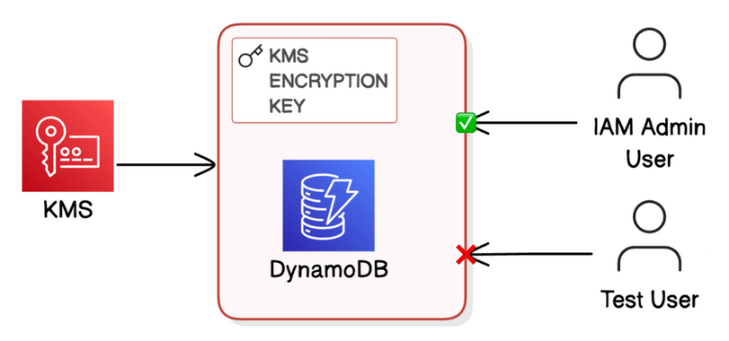

# Encrypt Data with AWS KMS

## Overview

AWS Key Management Service (KMS) is a fully managed service for creating and controlling the cryptographic keys used to encrypt your data. Unlike encryption handled transparently by the AWS service itself (SSE-S3, for example, which manages its own keys), KMS gives you a customer-managed key (CMK) that you own, control, and can audit. Every encrypt and decrypt operation using a CMK is logged to AWS CloudTrail, which means you have a complete, tamper-evident record of which principal accessed which data and when. This separation of key ownership from data ownership is the foundation of envelope encryption, the model AWS uses across its services.

I built this project to understand encryption enforcement in practice, not just in theory. The central question was: if a DynamoDB table is encrypted with a customer-managed KMS key, and a user has full DynamoDB permissions but no KMS permissions, can they read the data? The answer is no, and demonstrating that answer concretely is the purpose of this project. The test IAM user (`test-dynamodb-user`) can call `GetItem` against the tables. That call will fail at the KMS layer when DynamoDB attempts to decrypt the data on the user's behalf, because the user has no `kms:Decrypt` permission on the key. DynamoDB access and data access are two different things when a customer-managed KMS key is involved.

The project also explores what a well-structured KMS key policy looks like. AWS does not let you create a KMS key without a key policy. The default policy grants the account root full access, but the correct approach is an explicit three-statement policy that separates key administration from key usage and establishes the root-level safety net separately. Understanding those three statements and why each one exists is practically useful any time you create a KMS key.

Technologies used: AWS KMS, AWS DynamoDB, AWS IAM, Terraform, AWS CloudTrail (for audit visibility).

---

## Architecture



The Terraform configuration creates four resources that work together. A customer-managed KMS key is provisioned first, with a three-statement key policy that controls who can administer the key and who can use it for cryptographic operations. Four DynamoDB tables are then created with server-side encryption pointing at that key's ARN, when DynamoDB writes an item, it calls `kms:GenerateDataKey` to obtain a data encryption key, encrypts the item, and stores only the encrypted ciphertext. When DynamoDB reads an item back, it calls `kms:Decrypt` to recover the data key and then decrypts the item in memory before returning it.

An IAM policy grants five DynamoDB operations (PutItem, GetItem, UpdateItem, Query, Scan) scoped to the exact ARNs of the four tables. A test IAM user is created and attached to this policy. The user has everything it needs to interact with DynamoDB at the API level, but the key policy does not list the user as an authorized key user, so any read or write operation that requires KMS involvement will be denied at the KMS layer rather than the DynamoDB layer.

---

## Implementation Steps

### 1. KMS Key Provisioning

The KMS key is defined in `terraform/kms.tf`. The resource itself is minimal — the key's behavior is driven almost entirely by its policy:

```hcl
resource "aws_kms_key" "db_key" {
  description             = "KMS key for database encryption"
  deletion_window_in_days = 7
  enable_key_rotation     = true

  policy = data.aws_iam_policy_document.kms_policy.json
}
```

`deletion_window_in_days = 7` is the minimum AWS allows. KMS keys cannot be deleted immediately because data encrypted with the key becomes permanently unrecoverable the moment the key is gone. The seven-day window gives time to detect an accidental deletion and cancel it via `CancelKeyDeletion` before it becomes irreversible.

`enable_key_rotation = true` instructs KMS to automatically rotate the key material every year. Rotation generates new backing key material but does not change the key ARN or invalidate data encrypted under the previous material, KMS retains old versions of the key material and uses the correct version to decrypt older ciphertext transparently. This is managed rotation, which means there is no operational procedure to run and no re-encryption of existing data required.

### 2. KMS Key Policy — Three-Statement Design

The key policy is built using `data.aws_iam_policy_document` in `terraform/data.tf`. It contains three statements, each serving a distinct purpose.

#### Statement 1: EnableIAMUserPermissions

```hcl
statement {
  sid = "EnableIAMUserPermissions"

  principals {
    type        = "AWS"
    identifiers = ["arn:aws:iam::${data.aws_caller_identity.current.account_id}:root"]
  }

  actions   = ["kms:*"]
  resources = ["*"]
}
```

This statement grants the account root principal full access to the key. It is the safety net. If every other principal with key access is deleted or loses permissions, the root can still administer the key. Without this statement, it is possible to provision a KMS key that no one can manage, a condition AWS calls a "locked out" key, which requires contacting AWS Support to recover. This statement does not grant broad access to all IAM principals in the account; it grants access only to the root identity, which cannot be assumed by a role or used programmatically in normal circumstances.

#### Statement 2: AllowKeyAdministrators

```hcl
statement {
  sid = "AllowKeyAdministrators"

  principals {
    type        = "AWS"
    identifiers = [data.aws_caller_identity.current.arn]
  }

  actions = [
    "kms:Create*", "kms:Describe*", "kms:Enable*", "kms:List*",
    "kms:Put*",    "kms:Update*",   "kms:Revoke*", "kms:Disable*",
    "kms:Get*",    "kms:Delete*",   "kms:ScheduleKeyDeletion",
    "kms:CancelKeyDeletion"
  ]
  resources = ["*"]
}
```

This statement identifies the key administrator: the IAM identity used to run `terraform apply`. Key administrators can change the key policy, disable the key, and schedule its deletion, but they cannot use the key for cryptographic operations unless also listed as a key user. Separating administration from use follows the principle that the person who manages access controls should not also be the person who can access the data. In production, these would typically be different IAM roles attached to different teams.

#### Statement 3: AllowKeyUsers

```hcl
statement {
  sid = "AllowKeyUsers"

  principals {
    type        = "AWS"
    identifiers = [data.aws_caller_identity.current.arn]
  }

  actions = [
    "kms:Encrypt",
    "kms:Decrypt",
    "kms:ReEncrypt*",
    "kms:GenerateDataKey*",
    "kms:DescribeKey"
  ]
  resources = ["*"]
}
```

This statement grants the cryptographic operations. The deploying identity is listed here so that DynamoDB, acting on behalf of that identity, can call `GenerateDataKey` and `Decrypt` when reading and writing data. Notice that the test user is intentionally absent from this statement, that absence is the security control being demonstrated.

### 3. DynamoDB Tables with KMS Encryption

The four tables are defined in `terraform/main.tf` using a `for_each` loop over a locals map, the same pattern used in the `dynamo-db-data` project:

```hcl
locals {
  tables = {
    "ContentCatalog" = { pk = "Id",        pk_type = "N", rk = null,               rk_type = null }
    "Forum"          = { pk = "Name",      pk_type = "S", rk = null,               rk_type = null }
    "Post"           = { pk = "ForumName", pk_type = "S", rk = "Subject",          rk_type = "S"  }
    "Comment"        = { pk = "Id",        pk_type = "S", rk = "CommentDateTime",  rk_type = "S"  }
  }
}

resource "aws_dynamodb_table" "tables" {
  for_each       = local.tables
  name           = each.key
  billing_mode   = "PROVISIONED"
  read_capacity  = 1
  write_capacity = 1

  server_side_encryption {
    enabled     = true
    kms_key_arn = aws_kms_key.db_key.arn
  }

  point_in_time_recovery {
    enabled = true
  }
}
```

The `server_side_encryption` block is what binds each table to the customer-managed key. Without the `kms_key_arn`, `enabled = true` would use the AWS-owned DynamoDB key instead, a key that AWS controls and rotates, but that cannot be restricted via a key policy. Specifying `kms_key_arn` upgrades the encryption to a customer-managed key and activates all of the key policy controls discussed above.

### 4. IAM Policy and Test User

The IAM resources are in `terraform/iam.tf`. The policy grants the five DynamoDB operations needed for application use, scoped to the exact ARNs of the provisioned tables:

```hcl
resource "aws_iam_policy" "dynamodb_read_write" {
  name        = "${var.project_name}-policy"
  description = "Allows read/write access to the table"

  policy = jsonencode({
    Version = "2012-10-17"
    Statement = [
      {
        Action = [
          "dynamodb:PutItem",
          "dynamodb:GetItem",
          "dynamodb:UpdateItem",
          "dynamodb:Query",
          "dynamodb:Scan"
        ],
        Effect   = "Allow",
        Resource = [for table in aws_dynamodb_table.tables : table.arn]
      }
    ]
  })
}

resource "aws_iam_user" "test_user" {
  name = var.test_user_name
}

resource "aws_iam_user_policy_attachment" "test_user_dynamodb" {
  user       = aws_iam_user.test_user.name
  policy_arn = aws_iam_policy.dynamodb_read_write.arn
}
```

The test user (`test-dynamodb-user`) is attached to this policy. They have DynamoDB permissions. They have no KMS permissions anywhere, not in the IAM policy and not in the KMS key policy. When the user calls `GetItem`, DynamoDB tries to call `kms:Decrypt` on their behalf. That call hits the KMS key policy, finds no statement permitting the user, and returns an access denied error. DynamoDB surfaces this as an `AccessDeniedException`. The table exists. The user has DynamoDB access. The data is still protected.

### 5. Deploying with Terraform

The Terraform configuration lives in the `terraform/` directory. Before applying, populate `terraform.tfvars` with your AWS CLI profile and target region:

```hcl
profile        = "your-aws-profile"
region         = "eu-west-3"
test_user_name = "test-dynamodb-user"
```

Then initialise and apply:

```bash
cd terraform/
terraform init
terraform plan
terraform apply
```

After apply completes, the `table_arn` output lists the ARNs of all four tables. To tear down all resources:

```bash
terraform destroy
```

Note that the KMS key will enter a seven-day deletion pending state after `terraform destroy`. During those seven days the key is disabled but not yet deleted. If you need to re-provision without waiting, you can cancel the deletion via the KMS console or CLI and import the existing key ARN into a new Terraform state.

---

## Security Considerations

**The three-statement key policy separates concerns deliberately.** Root access, key administration, and key usage are three distinct capabilities in the policy. Merging them into a single broad statement would work, but it would make it impossible to grant someone key administration rights (to rotate or disable the key) without also granting them the ability to decrypt data. In a real deployment, statement two and statement three would reference different IAM roles owned by different teams.

**The test user demonstrates that DynamoDB access and data access are not the same thing.** This is the most important insight in the project. A misconfigured IAM policy that grants `dynamodb:*` does not grant access to the underlying encrypted data if the key policy does not include the principal. Conversely, a principal with KMS decrypt access but no DynamoDB permissions cannot read the data either so both layers must be satisfied. KMS encryption adds a second independent access control boundary that IAM alone cannot bypass.

**Point-in-Time Recovery is enabled on all four tables.** PITR maintains a continuous backup of each table for up to 35 days, allowing restoration to any second within that window. This is a data durability control rather than an access control, but it is a meaningful protection against accidental bulk deletes. For encrypted tables, the PITR backup is also encrypted with the same KMS key. Restoring a backup to a new table will fail if the key has been deleted, which is another reason the seven-day deletion window matters.

**Key rotation does not require re-encryption of existing data.** When KMS rotates the key material annually, existing ciphertext remains decryptable because KMS retains all previous versions of the key material internally. DynamoDB does not need to re-encrypt any items. The rotation only applies to new `GenerateDataKey` calls. This makes managed rotation a zero-operational-cost control.

**The least-privilege IAM policy excludes `DeleteItem`.** The test user can read, write, and query, but cannot delete items. More importantly, they cannot call `DescribeTable`, `CreateTable`, `DeleteTable`, or any key-management action. The policy is scoped to the exact four table ARNs generated by Terraform, so it cannot be repurposed to reach any other table in the account.

---

## Cost Analysis

**KMS customer-managed key**: AWS charges $1.00 per customer-managed key per month. This is a flat fee regardless of how many tables use the key. There is no free tier for customer-managed keys. One key encrypting all four tables costs the same as one key encrypting one table. A compelling reason to use a single shared key for related resources rather than one key per table (which would cost $4.00/month instead of $1.00/month).

**KMS API calls**: Beyond the flat key charge, AWS charges $0.03 per 10,000 API calls to KMS. Each DynamoDB read or write against an encrypted table generates one or two KMS calls (`GenerateDataKey` on write, `Decrypt` on read). At 1 RCU and 1 WCU per table for a low-traffic learning project, the API call cost is negligible.

**DynamoDB provisioned capacity**: Each table is provisioned at 1 RCU and 1 WCU. In `eu-west-3`, provisioned capacity costs approximately $0.000735 per RCU-hour and $0.000735 per WCU-hour. Four tables at 1 RCU + 1 WCU each amounts to roughly $4.30/month if all tables run continuously. The AWS Free Tier (first 12 months) includes 25 RCUs and 25 WCUs of provisioned capacity at no charge, which covers this entire project with room to spare.

**DynamoDB storage**: Approximately $0.283 per GB-month in `eu-west-3`. The sample data across four tables is a few kilobytes. Cost is effectively zero.

**PITR**: Charged only for the actual backup storage consumed, at approximately $0.209 per GB-month. Negligible for a small dataset.

**IAM**: Users, policies, and policy attachments have no cost. IAM resources are free.

**Summary**: For this project, the dominant cost is the KMS key flat fee of $1.00/month. DynamoDB capacity is covered by the free tier for new accounts. Total expected monthly cost outside the free tier is approximately $1.00–$2.00 depending on API call volume. Running `terraform destroy` immediately after the project removes all billable resources, though the KMS key continues to exist in a deletion pending state for seven days and does not incur further charges during that window.

---

## Key Takeaways

- **Customer-managed KMS keys add a second independent access control boundary.** IAM policies control who can call DynamoDB APIs. The KMS key policy controls who can decrypt the data those APIs return. Both must allow the principal for a read to succeed. Neither alone is sufficient.

- **The key policy safety net statement (root access) is not optional.** Without a statement granting the account root access to the key, it is possible to create a KMS key that cannot be administered if all other key administrators lose their IAM access. AWS calls this a locked-out key. The root statement is the last-resort recovery path.

- **Separating key administration from key usage enables role separation.** The key administrator can change the key policy and schedule deletion. The key user can encrypt and decrypt. In production, these should be separate IAM roles owned by separate teams. Mixing both into a single identity eliminates the ability to audit or restrict administrative changes to the key.

- **A seven-day key deletion window is not a delay — it is a safeguard.** Data encrypted with a deleted key is permanently unrecoverable. There is no AWS Support escalation that can recover ciphertext after the key is gone. The deletion window exists to give the `CancelKeyDeletion` call a chance to be used if the deletion was a mistake.

- **Managed key rotation is zero-cost operationally.** AWS rotates the key material automatically once per year and retains old versions indefinitely. Existing ciphertext decrypts transparently under the correct version. There is no re-encryption job to schedule and no downtime.

- **KMS encryption enforcement happens at the KMS layer, not the DynamoDB layer.** When a user calls `GetItem` on an encrypted table, DynamoDB transparently calls `kms:Decrypt`. If the KMS key policy denies that call, DynamoDB returns `AccessDeniedException` to the caller. The error looks like a DynamoDB error but originates in KMS. Knowing this helps when debugging access issues on encrypted tables.

- **One KMS key per project (not per table) reduces cost without reducing security.** All four tables share the same key. Each table's encryption is independent because DynamoDB uses envelope encryption, it generates a unique data key per item, encrypts the data key with the KMS CMK, and stores the encrypted data key alongside the ciphertext. Sharing the CMK does not mean items are encrypted with the same data key.

- **The `for` expression in the IAM policy resource list is automatically correct.** The `Resource` value is computed as `[for table in aws_dynamodb_table.tables : table.arn]`. If the locals map gains a fifth table, the IAM policy automatically includes it on the next `terraform apply`. No hardcoded ARNs need to be updated.

- **The test user scenario is a real attack surface, not a contrived example.** In real environments, it is common for application service accounts to accumulate overly broad IAM permissions over time. KMS customer-managed keys provide a hard enforcement point that cannot be bypassed even if DynamoDB permissions become too permissive.

- **PITR backups inherit the encryption of the source table.** If the KMS key is deleted, PITR restore will fail even if the table's data still exists in the backup. This means key lifecycle management and backup lifecycle management are coupled.

- **`billing_mode = "PROVISIONED"` at 1 RCU/1 WCU is appropriate for a learning project but will throttle under any real load.** For a production workload, `PAY_PER_REQUEST` removes capacity planning entirely at a higher per-request cost. For a bulk data load, temporarily switching to `PAY_PER_REQUEST` prevents throttling and unprocessed items, then switching back to `PROVISIONED` contains ongoing costs.

- **Terraform state contains the KMS key ARN and table ARNs.** If `terraform.tfstate` is lost, Terraform cannot manage the existing resources and will attempt to create duplicates on the next apply. For any real project, remote state (S3 + DynamoDB locking) is the correct approach. The local state file in this project is acceptable for a portfolio demonstration but should never be used for shared or production infrastructure.
