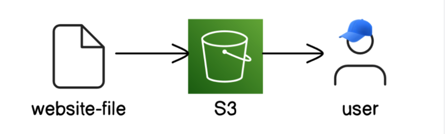

# Static Website Hosting on AWS S3

## Overview

**Cloud computing** moves the computing power from the physical devices we own to services we can access over the internet, anytime and anywhere. It moves all that work to massive data centers run by companies like Amazon. These data centers have enormous amounts of storage and processing power that your computer can use over the internet.

In this project we'll see how we can host a static website on AWS (Amazon Web Services) cloud.

The service we are going to use is called **S3 Storage**:
- It stores and receives any amount of data at anytime from anywhere on the web.
- It's one of the most important and fundamental services to start with.

## Architecture

## Implementation Steps

I started by creating an AWS account, which gave me access to the AWS Management Console. From there, I navigated to the S3 service and created a new bucket. The bucket name had to be globally unique across all AWS accounts.

The most critical decision came when configuring access controls. By default, S3 buckets are private, but hosting a public website requires public read access. I enabled ACLs (Access Control Lists) on the bucket, which allowed me to grant public read permissions to the uploaded objects. This differs from using bucket policies, but for a simple static website, ACLs provided a straightforward approach.

After uploading my `index.html` and other static assets to the bucket, I configured the bucket for static website hosting through the S3 console. This feature essentially turns the bucket into a web server, serving the index document when users access the bucket's website endpoint. The final step was making the bucket and its contents public, which involved adjusting the bucket's public access settings and applying the appropriate ACL permissions to the objects.

## Security Considerations

Making an S3 bucket public is generally discouraged in AWS best practices, but it's a necessary requirement for hosting a publicly accessible static website. I had to explicitly disable the "Block all public access" setting, which AWS warns about for good reason.

There are two primary ways to grant public access in S3: ACLs and bucket policies. I chose ACLs for this project because they're more versitile and allowed me to make individual objects public. Bucket policies would have been another valid approach, offering more centralized control over permissions.

The key takeaway: public S3 buckets should only be used when absolutely necessary, and even then, only specific objects should be public, never sensitive data or configuration files.

## Cost Analysis

S3 pricing is based on three factors: storage (per GB per month), requests (GET, PUT, etc.), and data transfer out to the internet. For a small static website, the costs are minimal and often fall within AWS's free tier for the first 12 months, which includes:
- 5 GB of S3 standard storage
- 20,000 GET requests
- 2,000 PUT requests

For this project, the total cost was effectively zero. However, I learned the importance of cleaning up resources when they're no longer needed. Deleting the bucket requires first emptying it of all objects, then deleting the bucket itself. Leaving unused resources running is a common way cloud costs accumulate unintentionally.

## Key Takeaways

This project was my first hands-on experience with AWS, and it demystified several cloud computing concepts:

- **S3 as object storage**: Unlike traditional file systems, S3 organizes data as objects within buckets, each with its own metadata and permissions.
- **Public vs. private access**: I gained practical understanding of how cloud security works at the resource level, and why the default-deny approach is critical.
- **Static website hosting**: I realized that S3 can serve as a simple web server for static content, without needing to manage any actual servers.
- **Cloud console navigation**: I became comfortable navigating the AWS console and understanding how different services interconnect.

The most valuable insight was understanding the trade-offs between simplicity and security. While this setup is perfect for learning and simple static sites, production environments would benefit from additional layers.

