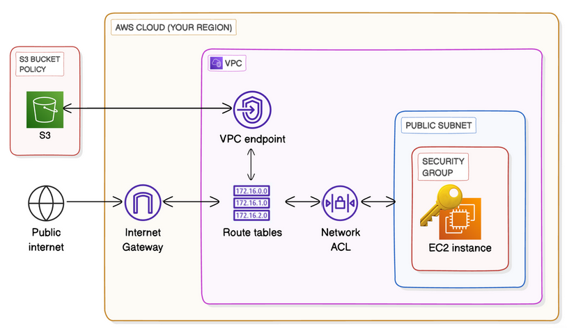

# VPC Endpoints

## Overview

A VPC endpoint is a private connection between your VPC and an AWS service that keeps traffic entirely on the AWS network — no internet gateway, NAT device, VPN, or Direct Connect required. This project extends [project #10 (S3 Access from VPC)](../s3-from-vpc/README.md) by replacing the internet-path S3 access with a **VPC Gateway Endpoint for S3**, and then enforcing that exclusive path through a **bucket policy data perimeter**. The result is an architecture where S3 traffic never leaves the AWS private network backbone, and where the bucket actively rejects any request that does not arrive through the endpoint.

The practical motivation is straightforward: in the previous project, an EC2 instance with IAM credentials could reach S3, but that traffic was still routed through the public internet. The instance had a public IP and an Internet Gateway and S3 calls went out the same path as SSH connections. A VPC endpoint eliminates that exposure for S3 specifically, and the bucket policy ensures that exposure cannot silently return (for example, if someone uses the same IAM credentials from a laptop at home).

**Technologies used:** Terraform, AWS VPC, EC2, S3, VPC Gateway Endpoint, bucket policies with VPC endpoint conditions, NACLs, Security Groups, Elastic IP.

---

## Architecture

The VPC (10.0.0.0/16) contains a single public subnet (10.0.1.0/24) with an EC2 instance reachable over SSH via an Elastic IP. An Internet Gateway handles inbound SSH and outbound general traffic as before. What changes is S3 traffic: a Gateway endpoint is attached to the subnet's route table, which automatically adds a route entry directing all S3-bound traffic (identified by the `com.amazonaws.region.s3` managed prefix list) to the endpoint rather than to the IGW. From the EC2 instance's perspective, `aws s3` commands resolve to the same S3 endpoints — but the underlying routing sends those packets through AWS's private network rather than out to the internet.

The bucket policy completes the picture. It denies any S3 request that does not carry the VPC endpoint ID in its request context, with a narrow exception for the account principal running Terraform. This means the IGW path to S3 is not just unused, it is actively blocked at the resource level.

---

## Implementation Steps

### 1. VPC Infrastructure

The foundation is identical to the s3-from-vpc project: a VPC with DNS support and hostnames enabled, a public subnet, an Internet Gateway, and a route table that sends all non-local traffic to the IGW. I enabled DNS hostnames specifically because it allows EC2 instances to resolve AWS service endpoints by name, which is relevant once the VPC endpoint is in place. The infrastructure is defined in `network.tf`.

### 2. Security Layer

The security group restricts SSH (port 22) and ICMP to my detected home IP, while HTTP and HTTPS remain open for outbound package management. The NACL mirrors those rules but requires explicit ephemeral port (1024–65535) rules in both directions — NACLs are stateless, so unlike security groups, they do not automatically allow return traffic. Getting this wrong is a common source of confusing connectivity failures, which is why I keep the NACL configuration explicit rather than relying on a permissive default. Both are defined in `security.tf`.

### 3. Dynamic IP Detection

An external Terraform data source runs a local bash script (`scripts/my_ip_json.sh`) that queries an external service and returns my current public IP as JSON. Terraform consumes this at plan time and injects the IP into security group and NACL rules. This avoids hardcoding my home IP into the configuration, which would break whenever my ISP rotates addresses. It is the same approach used in the previous project and I included it here without changes.

### 4. EC2 Instance and Key Pair

Terraform generates an RSA 4096-bit key pair, uploads the public key to AWS, and writes the private key locally with `0400` permissions. The EC2 instance runs Amazon Linux 2023 on a `t3.micro`, sourced via an AMI data lookup filtered by name pattern and architecture. The Elastic IP uses `depends_on = [aws_internet_gateway.test-igw]` to ensure the IGW exists before the EIP is allocated. Without this, Terraform can attempt to associate an EIP to a VPC that has no IGW, which succeeds at the resource level but produces a non-functional configuration. All of this is carried over from the s3-from-vpc project with no changes.

### 5. S3 Bucket Configuration

The S3 bucket is defined in `s3.tf` with a name derived from the project name variable and the AWS account ID to guarantee global uniqueness. Three settings distinguish this bucket from the previous project's: versioning is enabled, server-side encryption uses AES256, and all four public access block settings are enabled (`block_public_acls`, `block_public_policy`, `ignore_public_acls`, `restrict_public_buckets`). In the previous project I left public access block off to allow a public bucket policy. Here the bucket is entirely private, which meant I needed to rethink how access is granted — the answer is the VPC endpoint condition rather than public access.

### 6. VPC Gateway Endpoint for S3

The `aws_vpc_endpoint` resource creates a Gateway-type endpoint for `com.amazonaws.${region}.s3` and associates it with the subnet's route table via `route_table_ids`. When Terraform applies this, AWS automatically adds a managed route to the route table: traffic destined for any IP in the S3 prefix list for the region is directed to the endpoint rather than to the IGW. This route is invisible in Terraform state but it is visible in the AWS console under the route table.

Gateway endpoints are worth distinguishing from Interface endpoints. Gateway endpoints are free, support only S3 and DynamoDB, and work by modifying route tables. Interface endpoints (powered by AWS PrivateLink) support most other AWS services, cost approximately $0.01 per hour per Availability Zone plus data processing charges, and work by placing an Elastic Network Interface inside the subnet with a private IP. For S3, a Gateway endpoint is almost always the right choice: it is free, straightforward, and does not consume IP space in the subnet.

### 7. Bucket Policy as Data Perimeter

The bucket policy is where the architectural guarantee is enforced. It contains a single `Deny` statement with two conditions joined by an implicit AND. The first condition is `StringNotEqualsIfExists: {"aws:sourceVpce": <endpoint_id>}`, deny the request if the source VPC endpoint ID is anything other than the expected endpoint. The `IfExists` variant of the operator is deliberate: `StringNotEquals` would deny requests where the condition key is absent entirely (such as from AWS service principals that do not attach a source VPC endpoint), which could break legitimate service-to-service access. `StringNotEqualsIfExists` skips the condition check when the key does not exist in the request context, and only evaluates when the key is present but holds the wrong value.

The second condition is `ArnNotLike: {"aws:PrincipalArn": <caller_arn>}`, exclude the Terraform execution principal from the deny. Without this exception, Terraform itself would be blocked from managing the bucket, since it runs from outside the VPC. This is a deliberate operational compromise: the account principal retains direct access so that infrastructure management remains functional. In a production environment, I would evaluate whether a separate management endpoint or a stricter policy boundary is more appropriate, but for a learning project the trade-off is acceptable and worth understanding explicitly.

---

## Security Considerations

**Traffic isolation via the AWS private network.** The VPC endpoint routes all S3 traffic through AWS's internal backbone rather than the public internet. Even though the EC2 instance has a public IP and the VPC has an Internet Gateway, S3 calls never traverse the internet path. The IGW remains necessary for SSH access and outbound package management, but it is no longer in the data path for S3. This matters because traffic on the public internet is exposed to network-level risks, interception and routing anomalies that simply do not apply to traffic that stays inside the AWS network.

**The bucket policy as a perimeter control.** IAM policies govern what an authenticated principal is permitted to do. Bucket policies with VPC endpoint conditions govern from where a request is permitted to originate. These are complementary controls: IAM alone cannot prevent a user with valid credentials from accessing a bucket from their home laptop; only a resource-level policy that inspects the request's network context can enforce that. This project implements exactly that enforcement. The practical consequence is that even if an IAM access key is compromised, the attacker cannot use it to access this bucket unless they are also operating from within the VPC through the designated endpoint.

**The `StringNotEqualsIfExists` operator subtlety.** Using `StringNotEquals` instead of `StringNotEqualsIfExists` would make the policy overly broad. Some AWS service principals and cross-service calls do not include the `aws:sourceVpce` condition key in the request context at all. A strict `StringNotEquals` check treats a missing key the same as a wrong value and would deny those requests. The `IfExists` variant correctly handles this by treating absence of the key as a pass-through. Choosing the wrong operator here is a silent failure mode, the policy looks correct but either blocks legitimate traffic or fails to block illegitimate traffic depending on which direction the error goes.

**The `ArnNotLike` exception for the account principal.** The Terraform operator's IAM principal is excluded from the deny so that `terraform apply` and `terraform destroy` continue to work from outside the VPC. This is a pragmatic compromise, but it does create a gap: any process running as that principal can access the bucket from anywhere. In a production setting, I would consider tightening this by restricting Terraform to run from a bastion or CI/CD system inside the VPC, or by separating the management principal's permissions so it can manage bucket configuration but not read bucket contents.

**Public access block as a safety net.** All four public access block settings are enabled on the bucket. These settings operate independently of bucket policies: even if a misconfigured policy statement were to grant public access, the block settings would override it at the account and bucket level. This is defense in depth, the bucket policy enforces the VPC endpoint requirement, and the public access block ensures that no policy change can accidentally make the bucket publicly readable.

**IAM credentials on the instance.** Access to S3 from the EC2 instance is still configured via `aws configure`, which stores credentials in the instance's home directory. This is the same limitation acknowledged in the previous project. The production-correct approach is an IAM instance profile, which delivers short-lived credentials via the instance metadata service without storing long-lived keys anywhere. That remains a future improvement.

**Terraform state contains the private key.** The `tls_private_key` resource stores the generated private key in the Terraform state file in plaintext. For a personal learning project with local state, this is acceptable. Remote state with encryption (for example, S3 with SSE and a DynamoDB lock table) is the correct approach for any shared or production environment.

---

## Cost Analysis

The most notable cost characteristic of this project is that **VPC Gateway Endpoints are free**. There is no hourly charge and no per-GB data processing fee. This contrasts sharply with Interface endpoints, which cost approximately $0.01 per hour per Availability Zone (roughly $7.30 per month in a single AZ) plus $0.01 per GB of data processed. For S3 and DynamoDB workloads, Gateway endpoints provide the same private routing benefit at zero marginal cost, which makes them an easy default whenever the use case fits.

The EC2 instance runs on a `t3.micro` at approximately $0.0104 per hour, which falls within the free tier for the first 750 hours each month for eligible accounts. The Elastic IP is free while associated with a running instance; if the instance is stopped without releasing the EIP, a charge of $0.005 per hour applies.

S3 costs are minimal for a learning project. The first 5 GB of standard storage is free under the free tier, as are the first 20,000 GET requests and 2,000 PUT requests per month. Any test objects uploaded during this project remain well within those thresholds.

All resources are torn down with `terraform destroy` after the project is complete, which eliminates ongoing charges entirely. The private key file written locally is removed manually.

---

## Key Takeaways

- **VPC Gateway Endpoints eliminate internet exposure for S3 traffic at no cost.** Adding the endpoint modifies the route table automatically, and S3 calls from the EC2 instance are silently redirected through the AWS private network. From the application's perspective nothing changes but from a security and compliance perspective, a meaningful network boundary is established.

- **Gateway and Interface endpoints are fundamentally different mechanisms.** Gateway endpoints are free, work by injecting routes into a route table, and support only S3 and DynamoDB. Interface endpoints use PrivateLink, create an ENI in the subnet with a private IP, support most other AWS services, and carry an hourly cost per AZ. Choosing the wrong type for a given service is a common mistake when first working with VPC endpoints.

- **Bucket policies enforce the network origin of requests; IAM policies enforce the identity.** These are separate dimensions of access control and both are necessary for a complete security posture. A bucket policy with an `aws:sourceVpce` condition creates a data perimeter that prevents credential-based access from outside the designated network path, regardless of the IAM permissions attached to those credentials.

- **`StringNotEqualsIfExists` is not interchangeable with `StringNotEquals`.** When a condition key may be absent from the request context — as `aws:sourceVpce` is for non-endpoint requests, `StringNotEquals` treats absence as mismatch and denies, while `StringNotEqualsIfExists` treats absence as a pass-through. Using the wrong operator produces a policy that is either too permissive or too restrictive in ways that are difficult to debug without knowing this distinction.

- **Public access block is a distinct, independent control layer.** Enabling all four settings ensures that no bucket policy or ACL change can accidentally expose the bucket publicly. It is a safety net separate from the endpoint condition policy, and enabling it costs nothing.

- **The `ArnNotLike` exception highlights the tension between operational access and strict perimeter enforcement.** Excluding the Terraform principal from the deny is necessary for infrastructure management but creates a policy gap. Recognizing and documenting this trade-off explicitly is part of designing a real security architecture — not every gap can be closed immediately, but every gap should be understood.

- **`depends_on` on the Elastic IP is a non-obvious but necessary dependency.** Terraform's implicit dependency graph does not always capture the operational requirement that an IGW must exist before an EIP is functional in a VPC. The explicit `depends_on` prevents a class of timing-related apply failures that would otherwise produce a confusing error about EIP association.

