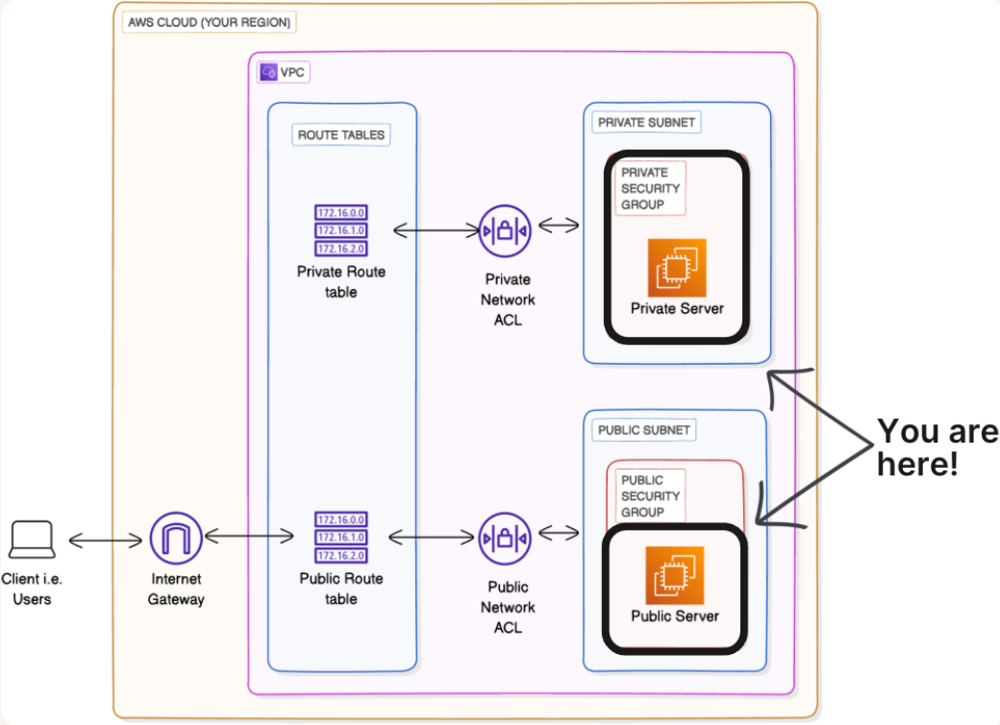

# Launching VPC Resources

## Overview

After building the VPC networking infrastructure across previous projects, creating the VPC, establishing public and private subnets, configuring route tables, implementing security groups and NACLs, this project brings all those concepts together by actually launching resources within that infrastructure.

This is where theory meets practice. I launched EC2 instances in both public and private subnets to understand how subnet placement affects resource behavior and accessibility. The key components I worked with include:
- **Public EC2 Instance**: Launched in the public subnet with internet access for external services
- **Private EC2 Instance**: Launched in the private subnet, isolated from direct internet access
- **Private Security Group**: Dedicated security group with restrictive rules for private subnet resources
- **VPC and More Option**: AWS's visual resource mapping feature that shows your VPC architecture as you configure it

This project represents a critical milestone: it's the first time I launched resources that actually incur costs. All previous VPC work like subnets, route tables, security groups, NACLs was free. EC2 instances cost money, which made proper cleanup and cost awareness essential.

## Architecture

## Implementation Steps

### 1. VPC Infrastructure Review

I began by reviewing the VPC infrastructure I had built in previous projects. This included the VPC with its CIDR block (e.g., 10.0.0.0/16), the public subnet with a route to the Internet Gateway, the private subnet with no direct internet access, and the route tables that control traffic flow. Understanding this foundation was critical because resource placement depends entirely on this underlying network architecture.

### 2. Planning EC2 Instance Placement

I planned which resources should go in which subnets based on their function and security requirements. Public subnets should host resources that need to be accessible from the internet (web servers, bastion hosts, load balancers). Private subnets should host backend resources that don't need direct internet access (application servers, databases, internal APIs). This architectural decision is fundamental to security because subnet placement determines whether a resource can be reached from the internet.

### 3. Launching Public EC2 Instance

I launched an EC2 instance in my public subnet. I selected a t2.micro instance type (eligible for free tier) and ensured it was placed in the public subnet. Because I had configured the public subnet with auto-assign public IPv4 enabled and a route table pointing to the Internet Gateway, this instance would receive a public IP address and have internet connectivity. I assigned a security group that allows necessary inbound traffic (such as SSH on port 22 or HTTP on port 80).

### 4. Creating Private Security Group

I created a dedicated security group specifically for resources in the private subnet. This security group would be more restrictive than the public security group because private resources should only be accessible from within the VPC or from specific trusted sources. Separating security groups by function and subnet type is a best practice that makes security policies easier to manage and audit.

### 5. Configuring Private Security Group Rules

I configured the private security group with restrictive rules. Instead of allowing inbound traffic from the internet (0.0.0.0/0), I only allowed traffic from sources within the VPC. For example, I might allow SSH access only from the public subnet's CIDR range, or allow database connections only from specific application server security groups. This implements the principle of least privilege at the instance level.

### 6. Launching Private EC2 Instance

I launched a second EC2 instance, this time in the private subnet. I assigned it the private security group I had just created. Crucially, this instance would not receive a public IP address (even if auto-assign public IPv4 was enabled) because there's no route to the Internet Gateway in the private subnet's route table. This instance is accessible only from within the VPC, providing the network isolation necessary for backend resources.

### 7. Exploring 'VPC and More' Option

I experimented with AWS's "VPC and More" option when creating VPC resources. This feature provides a visual resource map that shows your VPC architecture as you configure it—displaying subnets, route tables, Internet Gateways, and NAT Gateways in a diagram format. This visualization helped me understand how all the components connect and made it easier to verify my architecture matched my intentions. It's an excellent learning tool for understanding VPC structure.

### 8. Cleanup

To avoid ongoing charges, I terminated both EC2 instances and cleaned up associated resources. Even after instance termination, EBS volumes can persist and generate costs if not deleted. I verified all instances were fully terminated and any elastic IPs were released. Proper cleanup is critical when working with cost-generating resources.

## Security Considerations

**Public Instance Exposure**: Public instances are exposed to the internet, which means they're subject to constant scanning, probing, and potential attacks. I learned to use highly restrictive security groups even for public instances. For example, SSH access (port 22) should never be open to 0.0.0.0/0 in production. Instead, restrict it to specific IP addresses (your office IP, a bastion host, or use AWS Systems Manager Session Manager instead of SSH).

**Private Instance Isolation**: Private instances benefit from network-level protection. They have no direct internet access, which means they can't be reached from the internet even if their security group was misconfigured. This defense-in-depth approach is why sensitive resources like databases should always reside in private subnets.

**Security Group Design**: Creating separate security groups for public and private resources implements the principle of separation of duties. Public security groups might allow inbound HTTP/HTTPS from anywhere, while private security groups only allow connections from specific sources within the VPC. This granular control is what makes EC2 instance-level security effective.

**Bastion Host Pattern**: In production, accessing private instances typically requires a bastion host (jump box) in the public subnet. You SSH to the bastion, then from the bastion to the private instance. This pattern limits direct access to private resources while maintaining administrative access.

**Principle of Least Privilege**: I configured security groups to allow only the minimum necessary access. For the private instance, this meant allowing inbound traffic only from specific sources (like the public subnet CIDR or specific security groups), not from the entire internet.

**Defense in Depth**: Launching resources in this architecture demonstrated how multiple security layers work together. The private instance benefits from subnet isolation (no internet route), security group rules (instance-level firewall), and optionally NACLs (subnet-level firewall). Even if one layer is misconfigured, others provide protection.

**Resource Placement is a Security Decision**: Where you launch a resource, public vs private subnet is a critical security architecture decision with lasting implications. It's much harder to move resources between subnets later than to place them correctly initially.

## Cost Analysis

**EC2 Instances - First Real Costs**: This is the first project in the series that generates actual charges. EC2 instances cost money based on instance type and running time. A t2.micro instance is eligible for free tier (750 hours per month for the first 12 months), but once you exceed free tier limits or use larger instance types, charges accrue.

**Running vs Stopped Instances**: Running instances incur compute charges. Stopped instances don't incur compute charges but still incur EBS storage charges for attached volumes. To completely avoid costs, you must terminate instances, not just stop them.

**Data Transfer Costs**: The public instance generates data transfer charges when sending data out to the internet. Data transfer in is free, but outbound transfer beyond AWS's free tier (1 GB per month) costs money. These are usage-based charges, not infrastructure charges.

**Free Tier Eligibility**: New AWS accounts get 750 hours of t2.micro usage per month for 12 months. Since there are 744 hours in a 31-day month, you can run one t2.micro instance continuously for free. Running two instances (as in this project) would consume 1,488 hours per month, exceeding free tier limits.

**VPC Infrastructure Remains Free**: All the VPC components like subnets, route tables, security groups, NACLs, Internet Gateway remain free. Only the resources launched within that infrastructure (EC2 instances) generate costs.

**EBS Volume Costs**: Each EC2 instance has an attached EBS volume for storage. These volumes cost money based on size and type. Even after stopping an instance, EBS volumes persist and continue to generate charges until you terminate the instance or manually delete the volumes.

**Cleanup Prevents Unexpected Charges**: I learned to terminate instances immediately after completing experiments. Forgetting a running instance can result in unexpected charges.

## Key Takeaways

**VPC Concepts Become Practical**: All the abstract VPC concepts from previous projects (subnets, route tables, security groups) became concrete when I launched actual resources. Seeing how subnet placement affects instance behavior solidified my understanding of VPC architecture.

**Public Subnet = Internet Accessibility**: Launching an instance in a public subnet, combined with a route to the Internet Gateway and auto-assign public IPv4, is what enables internet access. All three components must be configured correctly for internet connectivity.

**Private Subnet = Network Isolation**: Placing an instance in a private subnet (with no route to an Internet Gateway) provides network-level protection. The instance cannot be reached directly from the internet, regardless of security group configuration.

**Security Groups Are Per-Instance Firewalls**: Unlike NACLs that apply to all resources in a subnet, security groups are assigned to individual instances. This granular control allows different security policies for different resources within the same subnet.

**VPC and More Simplifies Architecture**: The "VPC and More" option with its visual resource map is an excellent learning tool. Seeing the architecture diagram update in real-time as I configured resources helped me understand how components interconnect. For production work, this visual feedback helps prevent configuration mistakes.

**Resource Placement is Critical**: Deciding whether to launch a resource in a public or private subnet is a foundational architecture decision with security, cost, and functionality implications. This decision should be made deliberately based on the resource's purpose and security requirements.

**First Project with Real Costs**: This marked a significant shift from pure infrastructure projects (which were free) to launching resources that generate ongoing charges. Cost awareness became as important as technical understanding. Monitoring costs and practicing proper cleanup became essential skills.

**Proper Cleanup is Non-Negotiable**: Terminating instances and cleaning up resources isn't optional. Unlike free VPC infrastructure that could be left in place without consequences, EC2 instances generate ongoing costs. Developing cleanup habits now prevents costly mistakes later.
