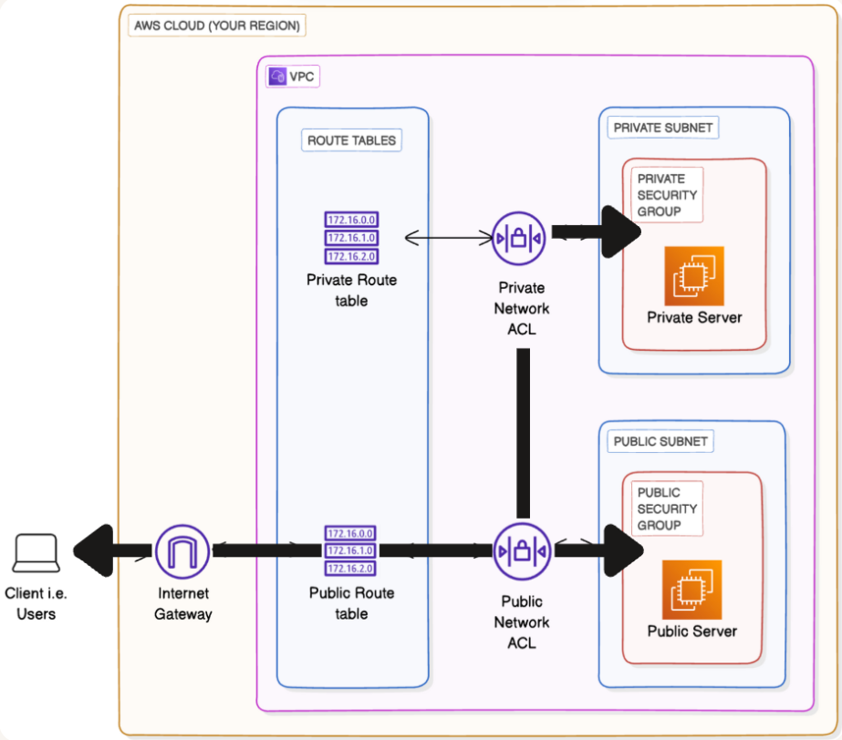

# Testing VPC Connectivity

## Overview

After building VPC infrastructure and configuring security controls in previous projects, the critical next step is validating that everything works as designed. This project focuses on practical connectivity testing and the hands-on validation that brings all VPC concepts together through real-world troubleshooting and verification techniques.

Testing connectivity in cloud networks isn't just about confirming things work; it's about understanding *why* they work (or don't). Through this project, I learned to use essential networking tools and protocols that cloud engineers rely on daily:

- **EC2 Instance Connect**: Browser-based SSH access to EC2 instances without managing key pairs
- **SSH (Secure Shell)**: The standard protocol for secure remote access to Linux instances
- **Ping and ICMP**: The fundamental troubleshooting tool for testing network reachability
- **Curl and HTTP**: Testing web connectivity and validating internet access

The project builds directly upon the VPC infrastructure from previous work, public and private EC2 instances within a custom VPC, and validates the network architecture through systematic testing. I learned how security groups directly impact what connectivity tests succeed or fail, and how to methodically troubleshoot network issues by understanding traffic flow patterns.

Most importantly, this project demonstrated that theoretical network design must be validated through practical testing. A perfectly configured VPC on paper means nothing until you can prove that instances communicate as intended, that security controls function correctly, and that traffic flows match your architectural expectations.

## Architecture

## Implementation Steps

### 1. VPC Infrastructure Setup

I started with the infrastructure from the previous "Launching VPC Resources" project: a custom VPC containing both a public EC2 instance (in a public subnet with an Internet Gateway route) and a private EC2 instance (in a private subnet without internet access). This existing setup provided the perfect testing environment to validate connectivity patterns between different network zones.

### 2. Connecting to Public EC2 Instance

I used EC2 Instance Connect to access my public EC2 instance directly from the AWS Console. This browser-based connection method was remarkably simple—just clicking "Connect" in the EC2 dashboard opened a terminal session in my browser. No SSH key management, no client software, just immediate access. This demonstrated how AWS simplifies common tasks while maintaining security through IAM permissions.

### 3. Understanding SSH

While EC2 Instance Connect is convenient, I learned that the underlying technology is SSH (Secure Shell). SSH is the industry-standard protocol for secure remote access to Linux systems, using cryptographic keys for authentication instead of passwords. Understanding SSH is fundamental for cloud engineering because virtually all remote server management relies on it. Even though EC2 Instance Connect handles the SSH connection automatically, knowing what's happening under the hood is crucial for troubleshooting and for scenarios where Instance Connect isn't available.

### 4. Testing Internal Connectivity with Ping

From my public EC2 instance, I attempted to ping my private EC2 instance using its private IP address. The ping command uses ICMP (Internet Control Message Protocol) to test network reachability. Initially, the ping failed, timing out without response. This failure wasn't a problem, it was expected and educational. It demonstrated that connectivity doesn't "just work" in AWS and security controls explicitly determine what traffic is allowed.

### 5. Configuring Security Groups for ICMP

I realized the ping was failing because the private instance's security group didn't allow inbound ICMP traffic. I modified the security group to add an inbound rule allowing ICMP traffic from the public instance's security group. This configuration demonstrated a powerful AWS feature: instead of specifying IP addresses in security group rules, you can reference other security groups. This approach is more maintainable because it automatically adapts as instances are added or removed from those groups.

### 6. Verifying Instance-to-Instance Communication

After updating the security group, I ran the ping command again. This time, it succeeded and I received ICMP echo replies from the private instance, confirming network connectivity. The round-trip times showed latency measurements, and the successful ping proved that: (1) routing between the subnets was working, (2) the security group rule was correctly configured, and (3) the private instance was reachable from the public instance. This validation was crucial because it confirmed my VPC networking was functioning as designed.

### 7. Testing Web Connectivity with Curl

Next, I used the curl command to test HTTP connectivity to the internet from both instances. From the public instance, `curl https://aws.amazon.com` succeeded, downloading the webpage HTML and confirming internet connectivity through the Internet Gateway. From the private instance (connecting via SSH from the public instance), the same curl command failed to reach the internet. This behavior was exactly as expected since private instances cannot initiate outbound internet connections without a NAT Gateway, which I hadn't configured.

### 8. Understanding Connectivity Patterns

Through these tests, I validated the fundamental VPC connectivity patterns: public instances can reach the internet (because their route table includes a 0.0.0.0/0 route to the Internet Gateway), while private instances cannot (because their route table has no such route). Both instance types can communicate with each other within the VPC (due to the automatic local route), but security groups control which specific traffic types are allowed. This hands-on validation made abstract networking concepts concrete and troubleshootable.

### 9. Cleanup

After completing my connectivity testing, I terminated both EC2 instances to avoid ongoing charges. Testing is essential for learning and validation, but resources should be cleaned up promptly afterward. I verified that both instances reached the "terminated" state in the EC2 console, ensuring no unexpected costs would accumulate.

## Security Considerations

**EC2 Instance Connect vs SSH Keys**: EC2 Instance Connect simplifies access by handling SSH key management automatically through IAM permissions. However, this convenience means you're relying on AWS infrastructure for access. Traditional SSH with your own key pairs gives you complete control but requires secure key storage and management. For production systems, many organizations use SSH keys with bastion hosts and strict key rotation policies, while EC2 Instance Connect works well for development and testing environments.

**SSH Security Best Practices**: SSH is secure by design, using strong encryption and key-based authentication. However, security depends on implementation. Best practices include: disabling password authentication (keys only), using specific key pairs per user or application, rotating keys periodically, restricting SSH access by source IP address in security groups, and monitoring SSH access logs for suspicious activity.

**ICMP for Troubleshooting**: Ping (ICMP) is invaluable for diagnosing network connectivity, but it can also be a security concern. Malicious actors sometimes use ping sweeps to discover active hosts, and certain ICMP-based attacks exist. In production environments, many organizations block ICMP from the internet while allowing it within the VPC for internal troubleshooting.

**Security Group Rules Must Be Intentional**: This project reinforced that in AWS, nothing happens by accident. Every connection, every ping, every HTTP request must be explicitly allowed through security group rules. This "deny by default" approach is excellent for security and it prevents accidental exposure. However, it requires intentional configuration and systematic testing to ensure legitimate traffic flows correctly.

**Public Instance as Attack Surface**: My public EC2 instance, with its public IP address and internet connectivity, represents an attack surface. Even though I limited inbound access through security groups, any internet-facing resource is potentially vulnerable. In production, minimize what services run on public instances, keep software patched, implement intrusion detection, and regularly review security group rules.

**Private Instance Access Pattern**: The private instance could only be accessed by connecting to the public instance first, then SSHing from there. This architecture pattern, using a public "jump box" or "bastion host" to access private resources, is a security best practice. It reduces attack surface by limiting direct internet access points and creates a controlled entry point where you can implement additional security monitoring and logging.

**Principle of Least Privilege in Practice**: Through testing, I applied least privilege by only opening the minimum necessary ports and protocols. I allowed ICMP between specific security groups (not all sources), allowed SSH only from trusted sources, and left other ports closed unless explicitly needed.

**Testing Validates Security Controls**: Finally, this project demonstrated that connectivity testing isn't just about confirming things work. It's about confirming security controls work. When ping initially failed, that failure proved the security group was protecting the private instance. When curl from the private instance failed to reach the internet, that failure proved the network architecture was correctly restricting outbound traffic. Both failures were actually security successes, validated through testing.

## Cost Analysis

**EC2 Instance Runtime**: The primary cost for this project was the runtime of two EC2 instances (public and private). Even t2.micro instances (covered under the AWS Free Tier for 750 hours per month) incur charges if you exceed the free tier or use larger instance types. For this testing project, runtime was measured in hours, not days, but it's important to recognize that every minute an instance runs, it's potentially costing money.

**Data Transfer Costs**: When I used curl to connect to websites from the public EC2 instance, I generated outbound data transfer to the internet. AWS charges for data transfer out to the internet (typically $0.09 per GB after the first 1 GB free per month). For simple connectivity tests downloading small amounts of data, these costs are negligible (likely cents), but in production systems with significant outbound traffic, data transfer costs can be substantial.

**EC2 Instance Connect is Free**: A significant advantage of EC2 Instance Connect is that it's completely free. AWS doesn't charge for using this connection method. Compared to third-party bastion services or session management tools, Instance Connect provides zero-cost remote access, which is valuable for learning and development environments.

**Testing Has No Additional Cost**: The actual testing activities, ping, SSH between instances, curl commands, don't incur separate charges beyond the base instance runtime and data transfer. This is important because it means you can thoroughly test and validate your infrastructure without worrying about per-test charges. However, inefficient testing that leaves instances running longer than necessary does increase costs.

**Importance of Prompt Cleanup**: The most significant cost consideration was remembering to terminate instances immediately after completing testing. Forgetting to terminate instances is a common mistake that leads to unexpected AWS bills. Even "small" t2.micro instances add up if left running for days or weeks. I made it a practice to verify termination in the console after cleanup, ensuring no resources were left running.

**Testing Investment**: While this project had costs (however minimal within free tier limits), those costs represent an investment in learning and validation. Testing connectivity is not optional and it's essential for confirming your infrastructure works correctly before deploying applications. The cost of testing is always lower than the cost of infrastructure failures in production.

## Key Takeaways

**Testing Validates Network Architecture**: The most important lesson from this project is that theoretical network design must be validated through practical testing. I could read documentation about VPCs, subnets, and security groups all day, but only by attempting to ping, SSH, and curl did I truly understand how these components interact and control traffic flow.

**EC2 Instance Connect Simplifies Access**: EC2 Instance Connect removes the complexity of SSH key management while maintaining security through IAM permissions. For learning, development, and testing scenarios, this is incredibly valuable. I could focus on understanding networking concepts rather than struggling with key pair files and SSH client configuration.

**SSH is Fundamental to Cloud Engineering**: Even though Instance Connect abstracts it away, understanding SSH is essential. SSH is how DevOps teams access servers, deploy applications, troubleshoot issues, and automate infrastructure management. Every cloud engineer needs to understand SSH authentication, key management, and security best practices.

**Ping is the First Troubleshooting Step**: When network connectivity issues arise, ping is almost always the first diagnostic tool to reach for. Its simplicity, just testing "can I reach this host?", makes it perfect for isolating where connectivity breaks down. This project taught me to use ping systematically: test connectivity, observe the failure, adjust security groups, test again, and validate success.

**Security Groups Control Traffic Flow**: This project made security groups tangible. They're not abstract rules in a console, they're the gatekeepers that determine whether your ping reaches its destination, whether your SSH connection succeeds, whether your web request goes through. Understanding how to configure security group rules and how to troubleshoot when they block intended traffic is a critical cloud skill.

**Curl Tests Real Application Connectivity**: While ping tests network-layer reachability, curl tests application-layer connectivity over HTTP/HTTPS. This distinction matters because many firewalls allow ICMP but block HTTP, or vice versa. Testing with curl validated that my public instance could reach the internet for actual application traffic, not just low-level ping packets.

**Bastion Host Pattern is Standard**: Accessing the private instance by first connecting to the public instance, then SSHing internally, is the bastion host (or jump box) pattern. This is a standard security architecture used in production AWS environments. Learning it through hands-on testing prepared me for real-world scenarios where direct access to private resources is restricted.

**Hands-On Testing is How You Learn Networking**: Reading about ICMP, security groups, and route tables gave me theoretical knowledge. But actually running ping commands, watching them fail, modifying security groups, and seeing them succeed made networking concepts click. Cloud networking can seem abstract when you're reading documentation, but it becomes concrete and understandable when you're troubleshooting why your ping isn't working.

**Systematic Testing Methodology**: This project taught me a methodology: start with a hypothesis (these instances should be able to communicate), test it (ping), observe the result (failure), form a theory (security group is blocking ICMP), make a change (add ICMP rule), and retest (ping succeeds). This systematic approach to troubleshooting is applicable to any networking problem in cloud environments.
